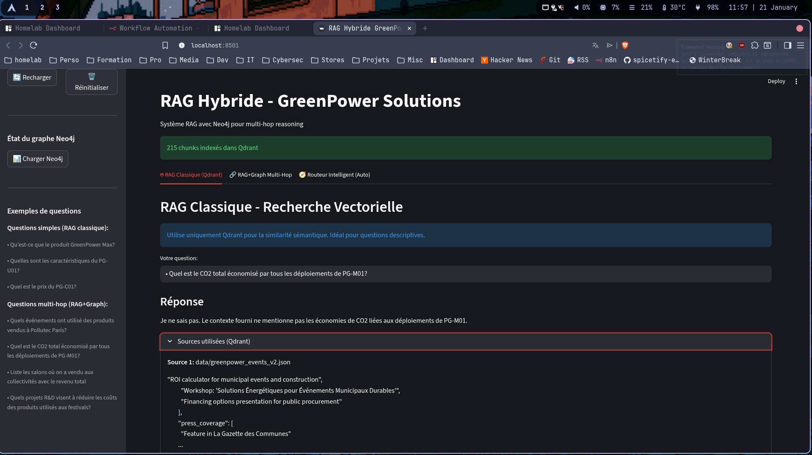
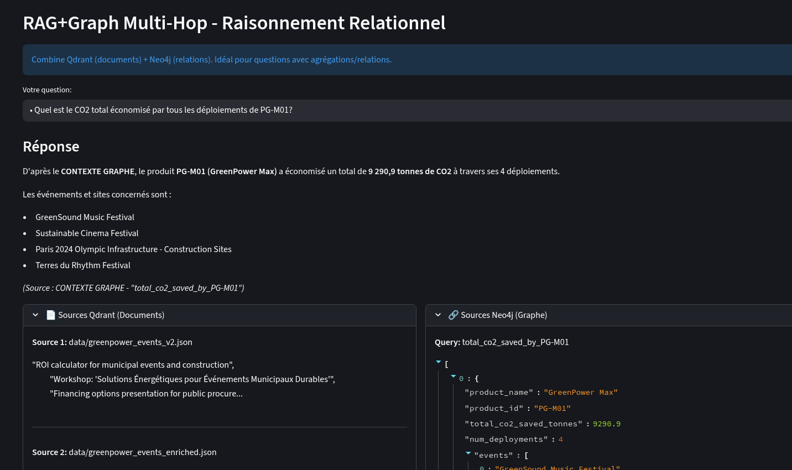
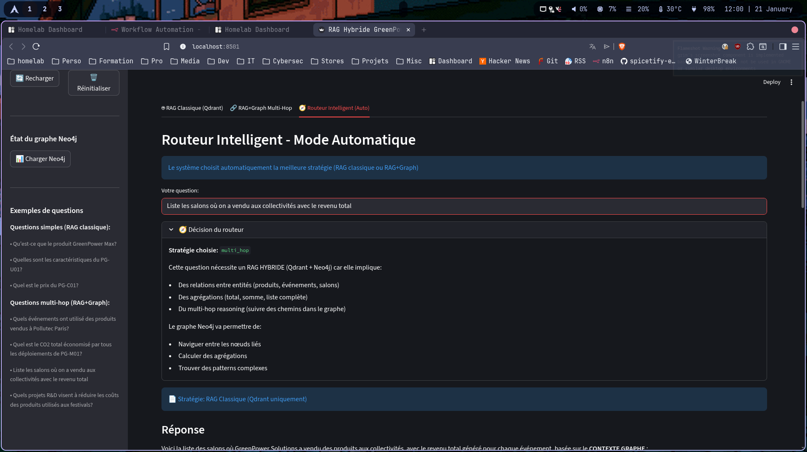

# RAG Hybride avec Neo4j - GreenPower Solutions

Système de Retrieval-Augmented Generation hybride combinant **recherche vectorielle (Qdrant)** et **graphe de connaissances (Neo4j)** pour le multi-hop reasoning sur les données GreenPower.

**🚀 Démarrage rapide:**
```bash
./deploy.sh          # Installation complète

source venv/bin/activate
streamlit run app_hybrid.py  # Lancer l'application
```


## 🎯 Fonctionnalités

- **RAG Classique**: Recherche vectorielle pour questions descriptives simples

- **RAG Hybride**: Combine vecteurs + graphe pour questions relationnelles complexes

- **Routeur Intelligent**: Classification automatique des questions

- **Dashboard Métriques**: Visualisation des performances Qdrant et Neo4j en temps réel

## 🏗️ Architecture

```
Question → Routeur → [RAG Simple] ou [RAG Hybride]
                          ↓              ↓
                       Qdrant      Qdrant + Neo4j
                          ↓              ↓
                       Réponse      Réponse enrichie
```

### Installation Manuelle

Si vous préférez installer manuellement :

```bash
# 1. Créer l'environnement virtuel
python3 -m venv venv
source venv/bin/activate

# 2. Installer les dépendances
pip install -r requirements.txt

# 3. Configurer l'environnement
cp env.example .env
# Éditer .env avec vos clés API

# 4. Initialiser le système
python init_system.py
```

### Lancer l'application

```bash
streamlit run app_hybrid.py
```

L'application s'ouvre sur http://localhost:8501

## 📁 Structure du Projet

```
.
├── deploy.sh               # 🚀 Script de déploiement unifié
├── app_hybrid.py           # Interface Streamlit (application principale)
├── hybrid_rag.py           # Routeur intelligent
├── dashboard.py            # Dashboard métriques et performance
├── neo4j_loader.py         # Parse JSONs → Graphe Neo4j
├── neo4j_query.py          # Requêtes Cypher multi-hop
├── init_system.py          # Script d'initialisation
├── requirements.txt        # Dépendances Python
├── .env                    # Configuration (Neo4j, Qdrant, Mistral)
├── env.example             # Exemple de configuration
└── data/                   # Données GreenPower (JSONs)
    ├── greenpower_products_enriched.json
    ├── greenpower_events_enriched.json
    └── greenpower_rd_innovations.json
```

## 🔧 Configuration

Remplir le fichier `.env` avec vos clés API (cf le fichier env.example)

## 🐛 Troubleshooting

### Timeout Qdrant lors du premier lancement

**Normal!** La première création prend ~60s. Les fois suivantes c'est instantané.

### Pas de résultats multi-hop

```bash
# Recharger les données Neo4j
python neo4j_loader.py

# Ou via l'interface: bouton "📊 Charger Neo4j"
```

### Erreur de connexion Neo4j

```bash
# Vérifier le .env
cat .env | grep NEO4J

# Tester la connexion
python -c "from neo4j_loader import Neo4jLoader; l = Neo4jLoader(); print('✅ OK'); l.close()"
```

### Collection Qdrant corrompue

Dans la sidebar de l'app, cliquer sur **"🗑️ Réinitialiser"**

## 📝 Credits

**Projet**: Groupe 2 AI4industry
**Technologies**: Streamlit, Neo4j, Qdrant, Mistral AI, LangChain
