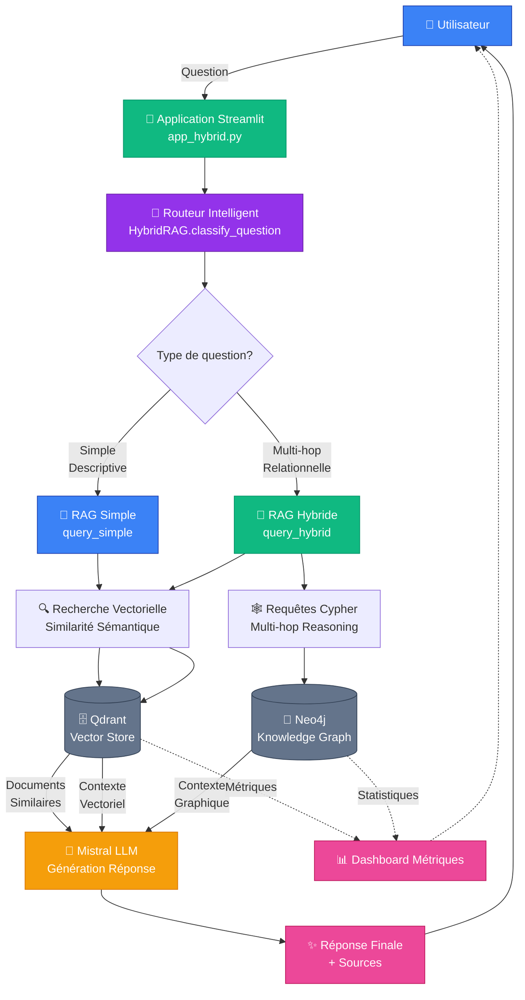
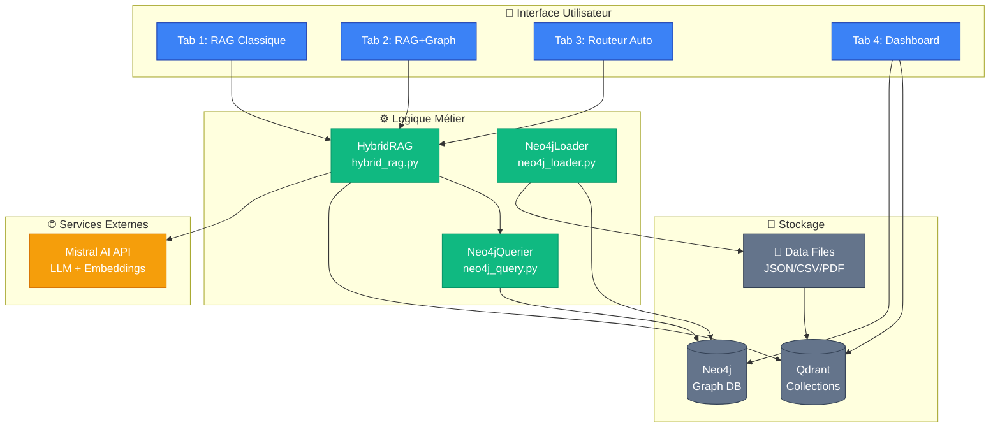
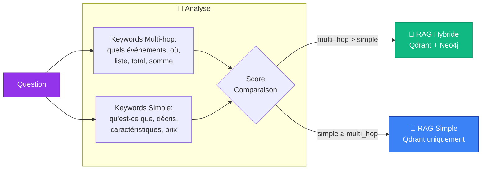
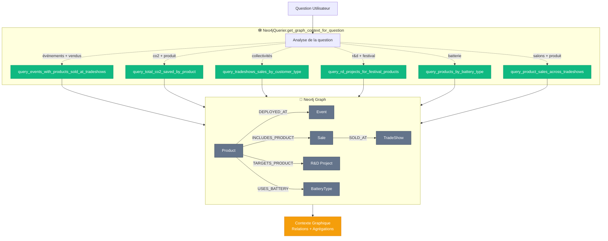
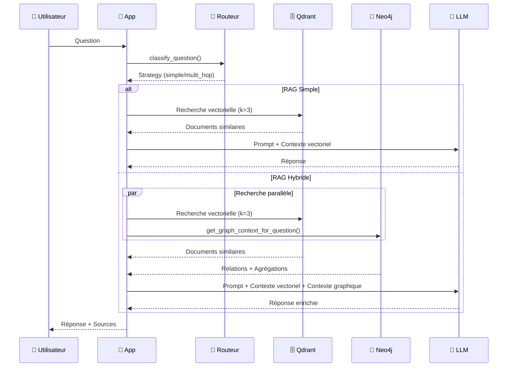
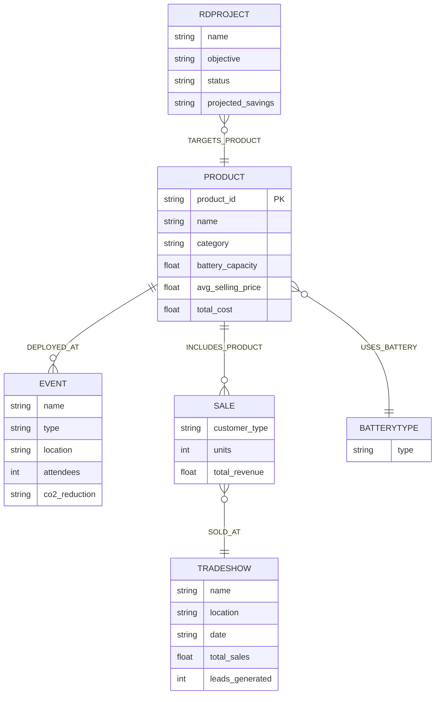
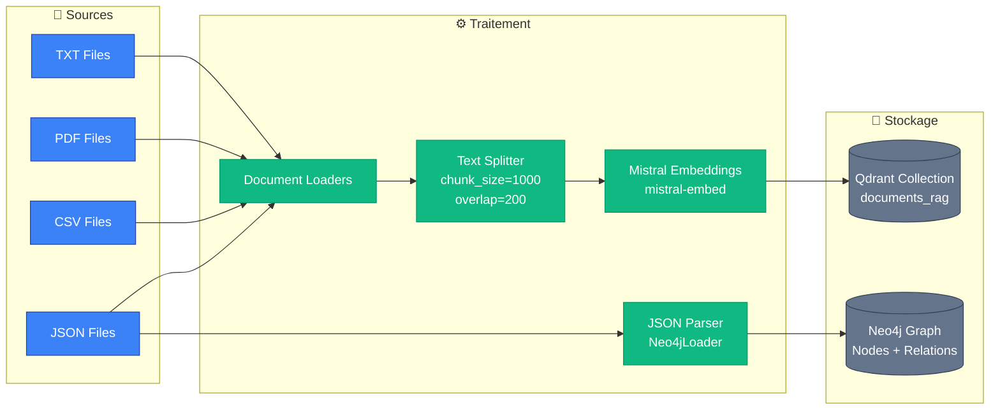
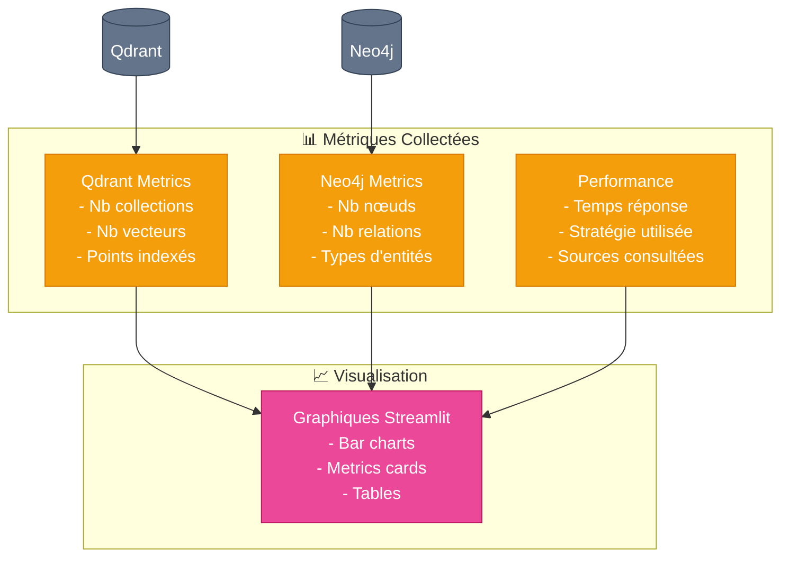

# Architecture Logique du RAG Hybride GreenPower

## Diagramme de Flux Principal

## Architecture des Composants

## Classification des Questions

## Requêtes Neo4j Multi-hop

## Pipeline de Génération de Réponse

## Schéma du Graphe Neo4j

## Flux de Données

## Métriques et Dashboard

## Légende

- 📄 **RAG Simple**: Questions descriptives simples (caractéristiques, prix, descriptions)
- 🔗 **RAG Hybride**: Questions complexes nécessitant des relations et agrégations
- 🧭 **Routeur**: Classification automatique basée sur les mots-clés
- 🗄️ **Qdrant**: Base vectorielle pour similarité sémantique
- 🔗 **Neo4j**: Graphe de connaissances pour multi-hop reasoning
- 🤖 **Mistral**: LLM pour génération de réponses et embeddings
